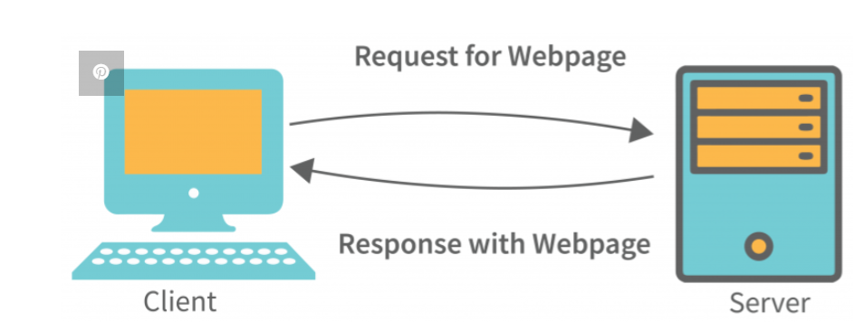
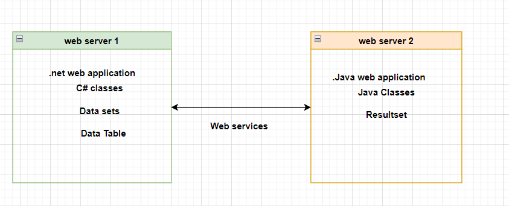
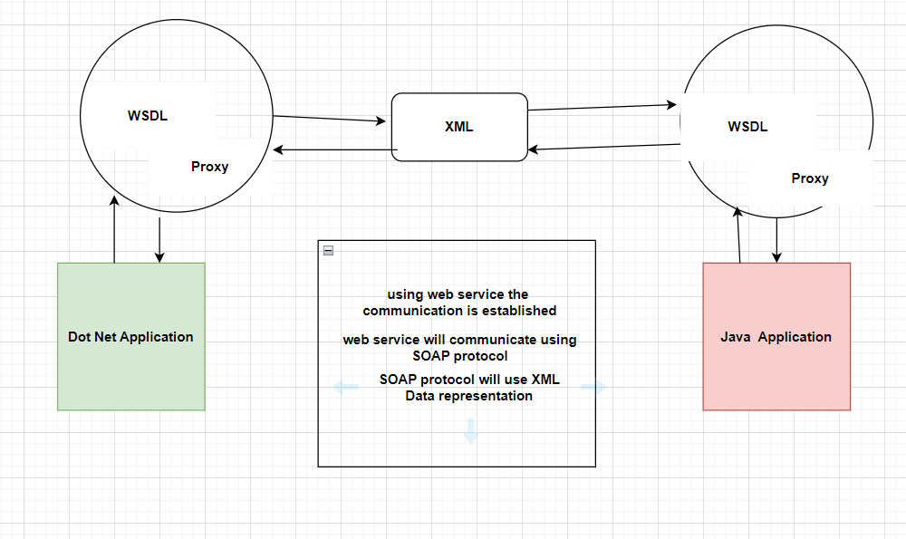
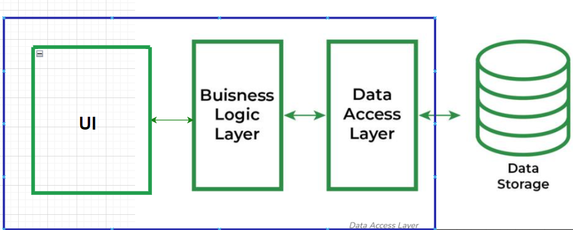
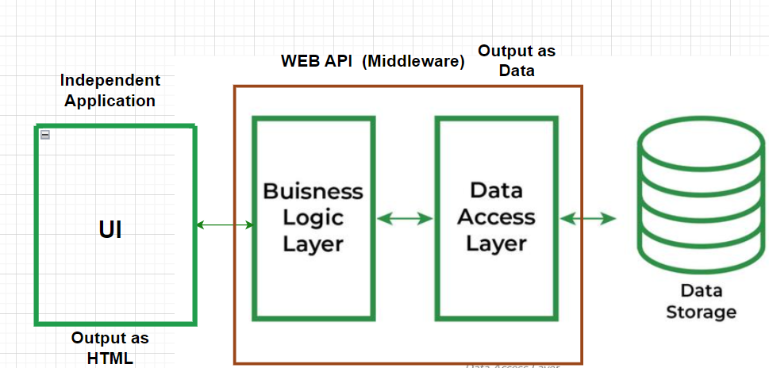
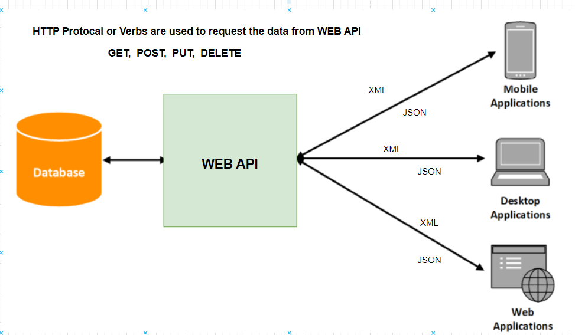

# Evolution of Web API.

##  How web application work.

* In web application we have a web server and a client.
* The client makes a request to the server.
* The server processe our request and sends response back to the client.
* 
  
## How two different web servers communicate.
* Suppose we have two webservers **webserver1**  and **webserver2**.
* If we want to establish a communication between two different webservers where one is running .Net application and another is running Java application.
* webserver1 will not understand Java objects and webserver2 will not understand .Net objects.
* so webservice came into picture whic makes it possible to establish communication between two webservers.
  

## How Web Services resolved the issue.
* This web service concept came up with the common data representatial pattern called XML.
* XML pattern is known by all the platforms or technologies.
* XML are SOAP based services.

## How Web Services work?
* suppoose .Net application wants to communicate with Java Application.
* we build web service which provides WSDL file.
* using this WSDL there is a proxy generated.
* Proxy will take the .Net object eg (DataSet that you want to pass to Java Application) and convert it to XML
* WSDL contains the instruction how you can convert the object into XML and how you communicate to other platform application.
* once we have an XML we pass it to Java application.
* Java Application will also have a WSDL and proxy  that will convert the XML int java objects that is how communication is established with the help of web services.
* Web services are mostly used for http calls.
  

## Web API
* Web API supports only  HTTP.
* It supports CRUD operation.
* As it it directly created for HTTP protocols you don't need to configure anything.You can just create a project and directly use it.
* Web APi are built using the REST(Representational State Transfer) implimentation.
* REST means what ever data we have we are going to send it as it is.

* UI and Web Api are two different projects.
* UI can be built using React, Angular MVC or anyother applications which supports UI building.
* The middleware can be built using the web API.
* The output of this WEB API is always data that can be XML or JSOn but most of the time we use JSOn as it is light weight.
  
  

# Why Web API
* using Web Api we can acheive reusablity.
* we use HTTP verbs (GET,POST,PUT,DELETE)or Protocols to get,insert,update or Delete data

