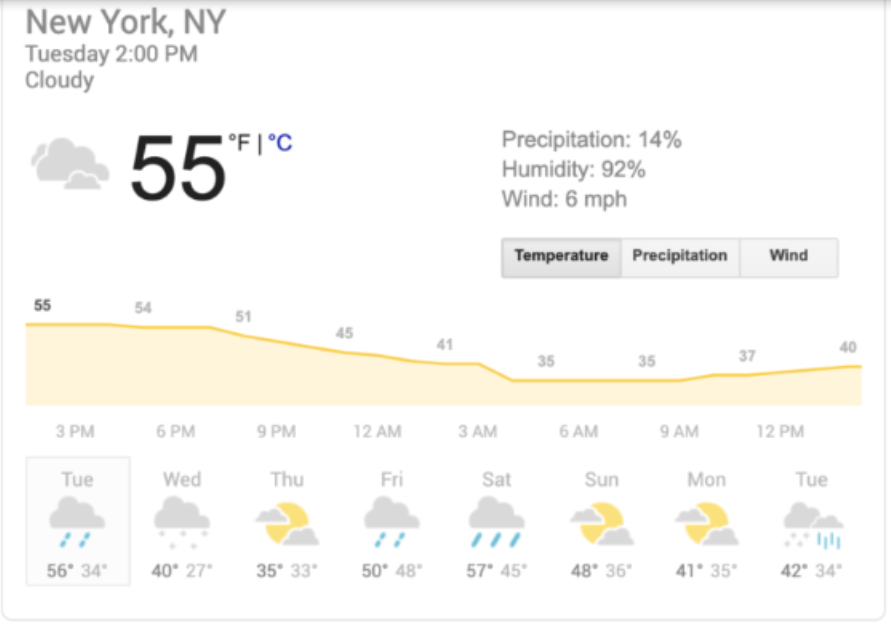
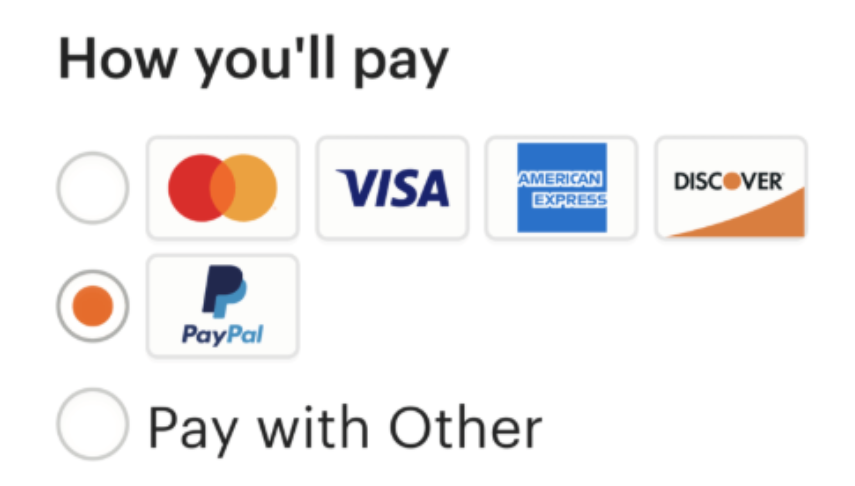

# API
**Intrduction:** 
* API stands for **Aplication Programming Interface**
* API is a set of rules and definitions that allows different software applications to communicate with each other.
* APIs define the methods and data formats that applications can use to request and exchange information.
  
# Example of APIs. 

> 1.  One common API usage example we come across on a daily basis is weather data.

 

> 2. Another prominent example of API usage is the “log-in using Facebook/Twitter/Google/Github” functionality you see on so many websites.
 

 > 3. Pay with PayPal
 